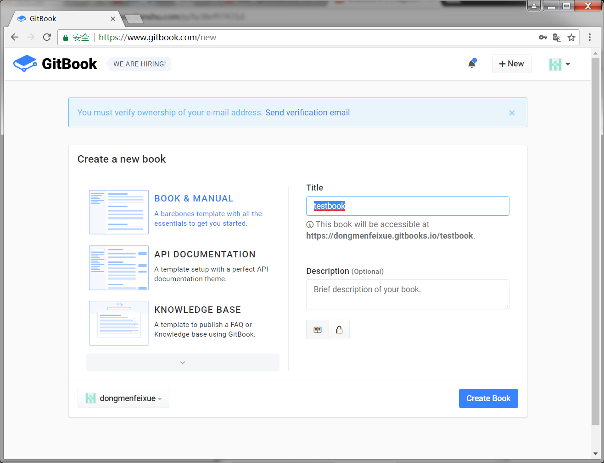
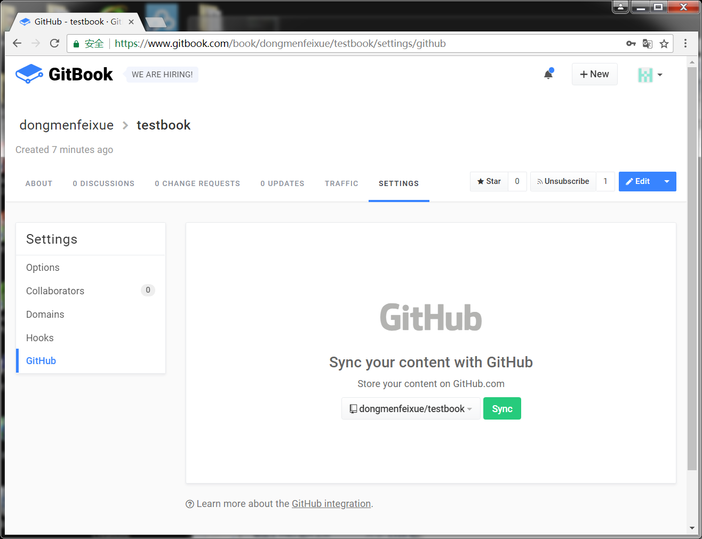
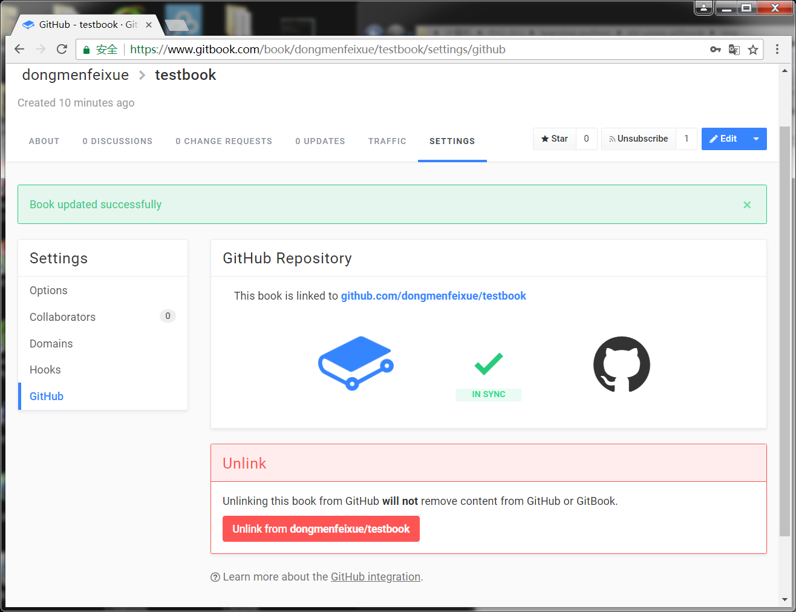
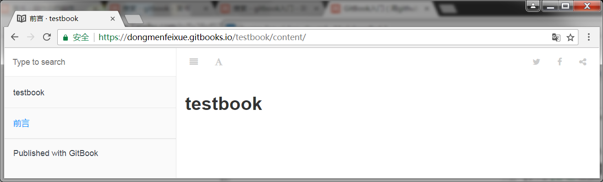

##创建一本书  

首先进入gitbook的官网：https://www.gitbook.com/  
  
使用gitbook注册名登录。  
  
选择建立一本新书和手册项。
  

进入testbook页面，点settings，选择github。  
选择dongmenfeixue的testbook仓库同步。

  
  
会出现矛盾，由于文件不一致，选择github进行同步，结果如下：
  

  
返回dongmenfeixue，点击testbook，点击read，发现只有一页，就是刚才我们在github仓库testbook中输入的内容。

  

