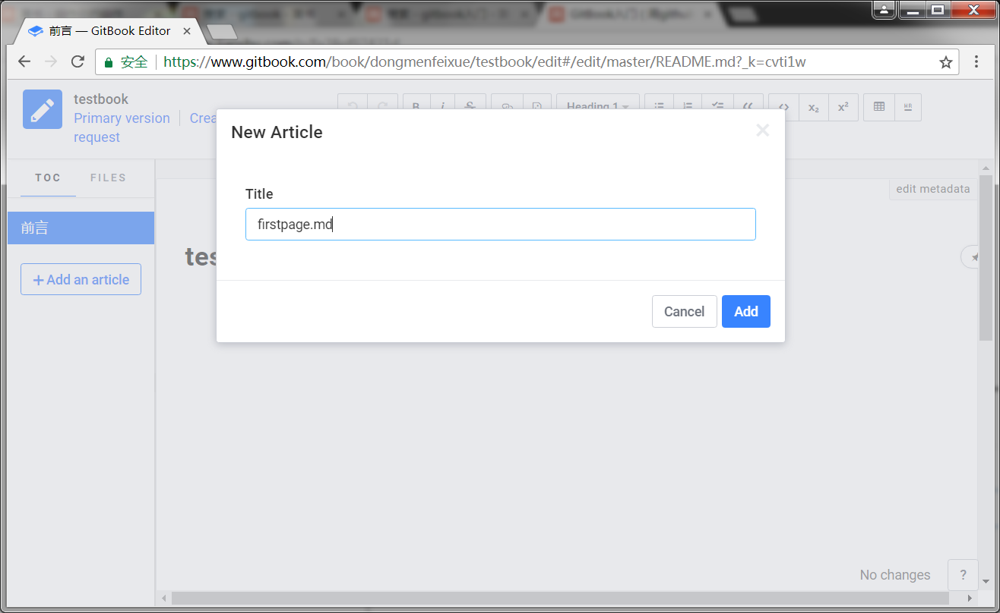
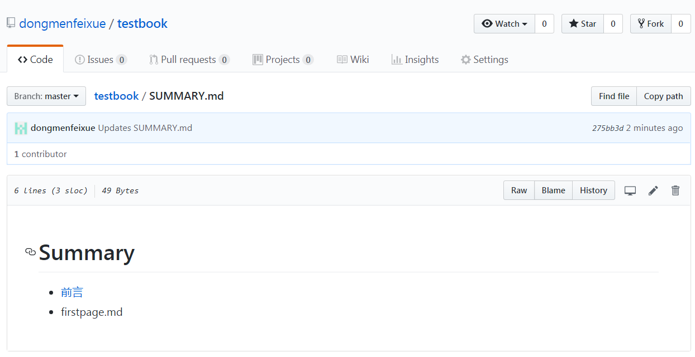
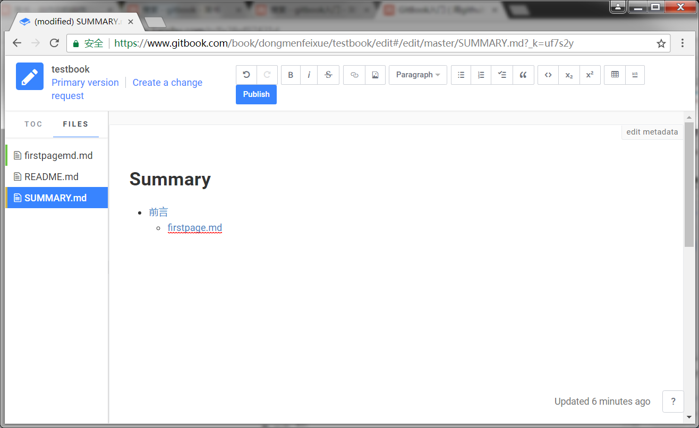

##增加内容  
  
退回到testbook，点edit。现在就可以完成书的录入了，在目录区点击右键，可以新建一个内容页。  
  

  
publish一下，然后你会发现在github上summary中也多了一个文件，这就关联起来了。  
  
  
  
我们修改一下名字，然后把他缩进一个tab，保存看看有什么变化。  

  
  
可以发现目录结构变了，然后名字也变了（但我试目前的gitbook中，名字没有变）。  
  
通过修改SUMMARY.md你可以轻松的组织你的书。
